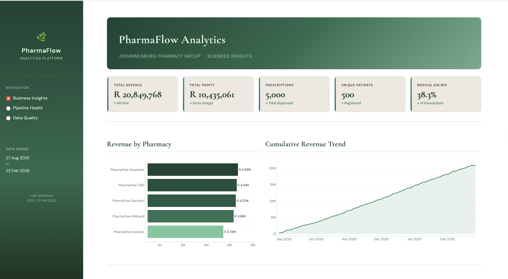
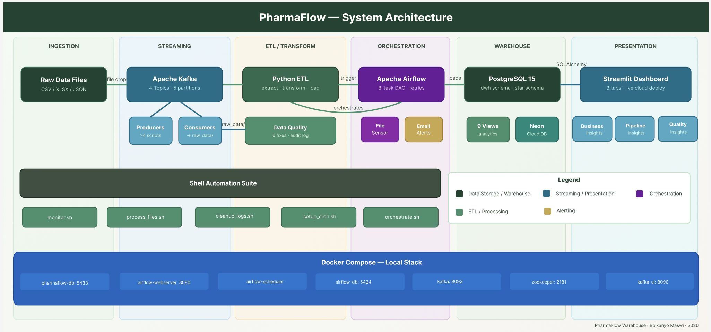
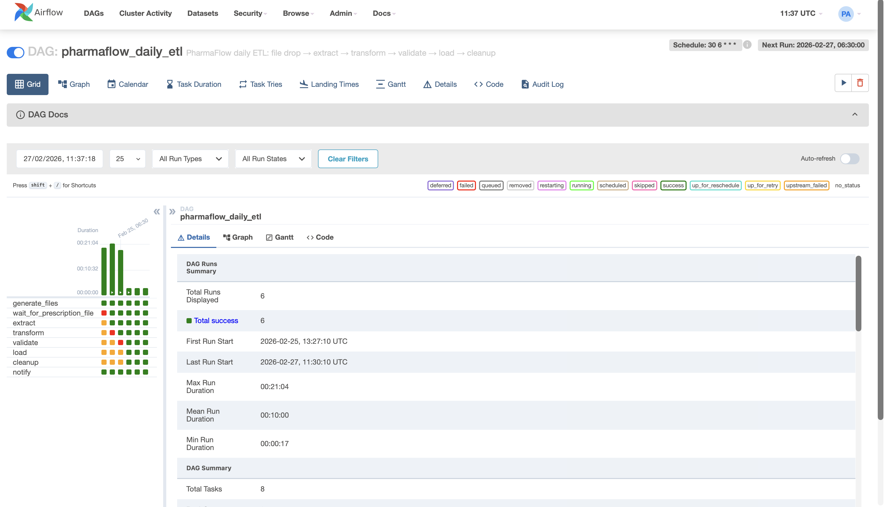
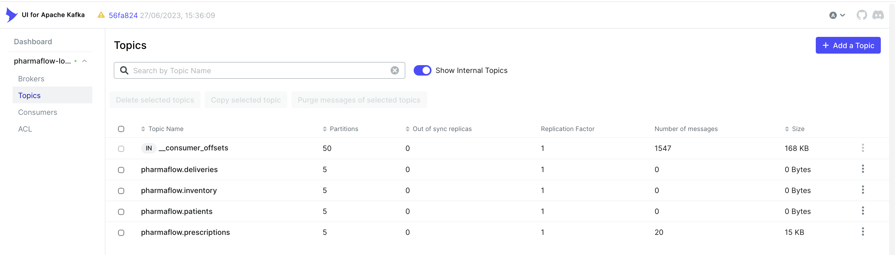
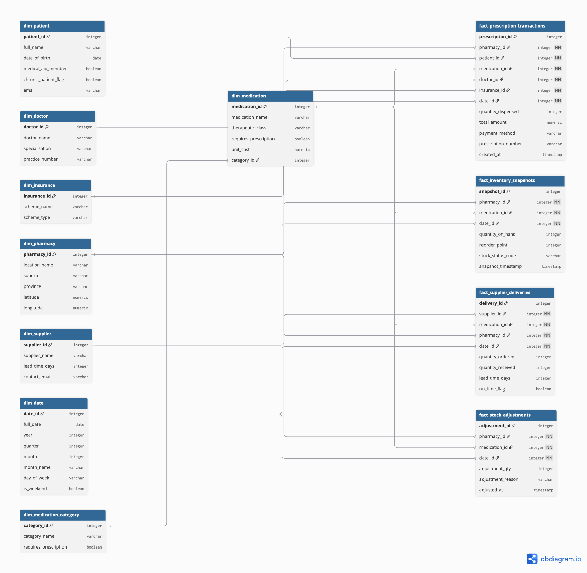

# PharmaFlow 

**End-to-End Pharmaceutical Supply Chain Data Pipeline & Warehouse**

A complete data engineering portfolio project simulating a mid-sized pharmacy chain across 5 Johannesburg locations. Covers the full data engineering stack: warehouse design, multi-format ETL, shell automation, Apache Airflow orchestration, real-time Kafka streaming, database administration, and a live analytics dashboard.

> Streamlit dashboard — Business Insights tab


> Architecture diagram showing full pipeline flow


---

## Table of Contents

- [Project Overview](#project-overview)
- [Technical Architecture](#technical-architecture)
- [Technology Stack](#technology-stack)
- [Project Structure](#project-structure)
- [Setup Instructions](#setup-instructions)
- [Pipeline Walkthrough](#pipeline-walkthrough)
- [Data Warehouse Schema](#data-warehouse-schema)
- [Key Analyses Supported](#key-analyses-supported)
- [Author](#author)

---

## Project Overview

**Company:** PharmaFlow

**Locations:** 5 pharmacies serving diverse Johannesburg demographics

| Location | Demographic Profile |
|---|---|
| Sandton | High income, high medical aid penetration |
| Soweto | High volume, predominantly cash |
| CBD | Mixed, high foot traffic |
| Rosebank | Mid-to-high income, chronic medication focus |
| Midrand | Suburban, family-oriented |

**Core Operations Modelled:**
- Prescription dispensing and tracking across all locations
- Multi-location inventory management with reorder point logic
- Supplier delivery monitoring and quality tracking
- Insurance (medical aid) claims processing
- Stock level optimisation and adjustment tracking

---

## Technical Architecture

```
┌─────────────────────────────────────────────────────────────────┐
│                          DATA SOURCES                           │
│   CSV (prescriptions)  │  Excel (inventory)  │  JSON (catalog)  │
└──────────────┬──────────────────────────────────────────────────┘
               │  raw_data/YYYY-MM-DD/
               ▼
┌─────────────────────────────────────────────────────────────────┐
│                      KAFKA STREAMING LAYER                      │
│   4 Producers → 4 Topics (5 partitions each) → 4 Consumers      │
│   prescriptions │ inventory │ patients │ deliveries             │
└──────────────┬──────────────────────────────────────────────────┘
               │  writes to raw_data/
               ▼
┌─────────────────────────────────────────────────────────────────┐
│                       SHELL INGESTION LAYER                     │
│   monitor_files.sh → process_file.sh → staging/ → archive/      │
└──────────────┬──────────────────────────────────────────────────┘
               │
               ▼
┌─────────────────────────────────────────────────────────────────┐
│                       PYTHON ETL PIPELINE                       │
│   extract.py → transform.py → validate → load.py                │
│   Multi-format readers │ 8 quality fixes │ SCD Type 2           │
└──────────────┬──────────────────────────────────────────────────┘
               │
               ▼
┌─────────────────────────────────────────────────────────────────┐
│                      AIRFLOW ORCHESTRATION                      │
│   FileSensor → extract → transform → validate → load →          │
│   cleanup → notify  │  Daily 06:30  │  Email alerts             │
└──────────────┬──────────────────────────────────────────────────┘
               │
               ▼
┌─────────────────────────────────────────────────────────────────┐
│                    POSTGRESQL DATA WAREHOUSE                    │
│   4 Fact Tables │ 8 Dimension Tables │ Star Schema              │
│   Partitioned by year │ 30+ indexes │ SCD Type 2 patients       │
└──────────────┬──────────────────────────────────────────────────┘
               │
               ▼
┌─────────────────────────────────────────────────────────────────┐
│                       STREAMLIT DASHBOARD                       │
│   Business Insights │ Pipeline Health │ Data Quality            │
└─────────────────────────────────────────────────────────────────┘
```

### Data Warehouse (Star Schema)
- **8 Dimension Tables:** Date, Patient, Medication, Doctor, Pharmacy, Insurance, Supplier, Category
- **4 Fact Tables:** Prescription Transactions, Inventory Snapshots, Supplier Deliveries, Stock Adjustments
- **Database:** PostgreSQL 15 (Docker containerized)
- **Records:** 15,000+ transactions across 6 months

### ETL Pipeline
- **Shell Scripts:** File monitoring, validation, staging
- **Python:** Data extraction, transformation, loading
- **Orchestration:** Apache Airflow (planned)
- **Data Sources:** CSV, JSON, Excel files with intentional quality issues

### Features

- **SCD Type 2:** Historical price tracking for medications
- **Data Quality Handling:** Duplicates, missing values, format errors, outliers
- **Seasonal Analysis:** Flu season and allergy season patterns
- **Demographics:** Location-based inventory and sales patterns
- **Automation:** Scheduled daily processing with cron jobs

> Airflow DAG graph view showing the 8-task pipeline




> Kafka UI showing the 4 topics with message counts


---

## Technology Stack

| Category | Technology |
|---|---|
| **Warehouse** | PostgreSQL 15 (Docker) |
| **Orchestration** | Apache Airflow 2.8.1 |
| **Streaming** | Apache Kafka (Confluent 7.5.0) + Zookeeper |
| **ETL Language** | Python 3.13 |
| **Shell Automation** | Bash |
| **Containerisation** | Docker + Docker Compose |
| **Dashboard** | Streamlit + Plotly |
| **Python Libraries** | pandas, psycopg2, kafka-python, Faker, openpyxl, python-dotenv |
| **Version Control** | Git / GitHub |

---

## Project Structure

```
pharmaflow_warehouse/
│
├── sql/                                # All SQL — schema, data generation, admin
│   ├── admin/                          # Database administration scripts
│   │   ├── indexes.sql                 # 30+ analytical indexes on all fact/dim tables
│   │   ├── partitioning.sql            # Partitions fact_prescription_transactions by year
│   │   ├── backup.sh                   # Automated daily/weekly/monthly pg_dump backups
│   │   └── query_performance.sql       # EXPLAIN ANALYZE on key dashboard queries
│   │
│   ├── monitoring/                     # Pipeline and data quality monitoring
│   │   ├── data_quality_log.sql        # Quality issue tracking table + summary views
│   │   ├── db_health.sql               # Table sizes, index usage, vacuum status, health score
│   │   └── pipeline_metrics.sql        # 7 views powering the Streamlit dashboard
│   │
│   ├── dimensions/                     # DDL for all 8 dimension tables
│   │   ├── dim_date.sql
│   │   ├── dim_doctor.sql
│   │   ├── dim_insurance.sql
│   │   ├── dim_supplier.sql
│   │   ├── dim_medication.sql
│   │   ├── dim_medication_category.sql
│   │   ├── dim_patient.sql             # SCD Type 2 — full history of patient changes
│   │   └── dim_pharmacy.sql
│   │
│   ├── facts/                          # DDL for all 4 fact tables
│   │   ├── fact_prescription_transactions.sql
│   │   ├── fact_inventory_snapshots.sql
│   │   ├── fact_supplier_deliveries.sql
│   │   └── fact_stock_adjustments.sql
│   │
│   └── sample_data/                    # Seed data for dimension tables
│       ├── load_doctors.sql
│       ├── load_medications.sql
│       ├── load_insurance.sql
│       ├── load_patients.sql
│       └── load_suppliers.sql
│
├── python/                             # Python data generation and ETL modules
│   ├── generate_patients.py            # Generates 500 synthetic patient records
│   ├── generate_prescriptions.py       # Generates 5,000 prescription transactions
│   ├── generate_inventory.py           # Generates 9,000 daily inventory snapshots
│   ├── generate_deliveries.py          # Generates 500 supplier delivery records
│   ├── generate_adjustments.py         # Generates 200 stock adjustment records
│   ├── export_sample_files.py          # Exports warehouse data to CSV/Excel/JSON
│   │                                   # with intentional data quality issues
│   └── etl/                            # ETL pipeline modules
│       ├── __init__.py
│       ├── extract.py                  # Multi-format reader (CSV, Excel, JSON)
│       │                               # Incremental load detection, FK key extraction
│       ├── transform.py                # 8 data quality fixes, business logic,
│       │                               # deduplication, SCD Type 2 change detection
│       ├── load.py                     # Upsert operations, SCD Type 2 patient loading,
│       │                               # pipeline_runs metadata logging
│       └── pipeline.py                 # CLI entry point: --date, --dry-run flags
│
├── scripts/                            # Bash automation scripts
│   ├── monitor_files.sh                # Polls raw_data/ for new files, triggers processing
│   ├── process_file.sh                 # Validates, stages, loads, and archives a single file
│   ├── cleanup_logs.sh                 # Rotates logs, compresses old processed files
│   ├── setup_cron.sh                   # Installs/removes daily 06:00 cron job
│   └── run_pipeline.sh                 # Master orchestrator — end-to-end pipeline runner
│
├── airflow/                            # Apache Airflow configuration
│   ├── dags/
│   │   └── pharmaflow_etl_dag.py       # 8-task DAG: FileSensor → extract → transform
│   │                                   # → validate → load → cleanup → notify
│   │                                   # Daily 06:30, retries with exponential backoff,
│   │                                   # email alerts on failure
│   ├── logs/                           # Airflow task execution logs (git-ignored)
│   └── plugins/                        # Custom Airflow plugins (empty, reserved)
│
├── kafka/                              # Real-time streaming layer
│   ├── producers/                      # Simulate live pharmacy events
│   │   ├── prescription_producer.py    # Publishes dispensing events (10/min default)
│   │   ├── inventory_producer.py       # Publishes stock level changes (3/min default)
│   │   ├── patient_producer.py         # Publishes patient registrations (1/min default)
│   │   └── delivery_producer.py        # Publishes supplier arrivals (1/min default)
│   ├── consumers/                      # Read from Kafka → write to raw_data/
│   │   ├── prescription_consumer.py    # → raw_data/YYYY-MM-DD/prescriptions_*.csv
│   │   ├── inventory_consumer.py       # → raw_data/YYYY-MM-DD/inventory_*.xlsx
│   │   ├── patient_consumer.py         # → raw_data/YYYY-MM-DD/new_patients.csv
│   │   └── delivery_consumer.py        # → raw_data/YYYY-MM-DD/deliveries_*.csv
│   ├── kafka_config.py                 # Shared broker config, topic names, simulation settings
│   ├── setup_topics.sh                 # One-time topic creation (5 partitions each)
│   └── run_demo.sh                     # Starts all producers + consumers for a live demo
│
├── dashboard/                          # Streamlit analytics dashboard
│   ├── app.py                          # Main dashboard — 3 tabs: Business Insights,
│   │                                   # Pipeline Health, Data Quality
│   └── requirements.txt                # Dashboard-specific Python dependencies
│
├── raw_data/                           # Daily file drop zone (git-ignored)
│   └── YYYY-MM-DD/                     # One folder per day, auto-created by producers
│       ├── prescriptions_YYYY-MM-DD.csv
│       ├── inventory_snapshot_YYYY-MM-DD.xlsx
│       ├── medication_catalog.json
│       └── new_patients.csv
│
├── staging/                            # Temporary holding area during file processing
│                                       # (git-ignored — files here are mid-pipeline)
├── processed/                          # Successfully loaded files, organised by date
│                                       # (git-ignored — compressed to .tar.gz after 7 days)
├── archive/                            # Long-term file archive
│   └── failed/                         # Files that failed validation or loading
│                                       # (git-ignored — preserved for investigation)
├── logs/                               # All pipeline and ETL execution logs
│                                       # (git-ignored — rotated and cleaned automatically)
├── backups/                            # Database backups (git-ignored)
│   ├── daily/                          # Last 7 daily pg_dump backups
│   ├── weekly/                         # Last 4 weekly backups (Sundays)
│   └── monthly/                        # Last 3 monthly backups (1st of month)
│
├── setup/
│   └── schema.sql                      # Complete warehouse DDL in a single file
│
├── docker-compose.yml                  # Full stack: PostgreSQL × 2, Airflow × 3,
│                                       # Kafka, Zookeeper, Kafka UI (8 services total)
├── requirements.txt                    # Python dependencies for the full project
├── .env                                # Environment variables — DB credentials, SMTP
│                                       # (git-ignored — never commit this file)
├── .env.example                        # Template for .env — safe to commit
└── .gitignore                          # Excludes venv, logs, raw_data, backups, .env
```

---

## Setup Instructions

### Prerequisites

- Docker Desktop (running)
- Python 3.13+
- Git

### 1. Clone the repository

```bash
git clone https://github.com/BM023/pharmaflow-warehouse.git
cd pharmaflow_warehouse
```

### 2. Configure environment variables

```bash
cp .env.example .env
# Edit .env with your credentials
```

`.env` should contain:
```
DB_HOST=localhost
DB_PORT=5433
DB_NAME=pharmaflow_warehouse
DB_USER=pharmaflow
DB_PASSWORD=pharmaflow2024
KAFKA_BOOTSTRAP_SERVERS=localhost:9093
```

### 3. Start the full Docker stack

```bash
docker compose up -d
docker compose ps   # verify all 8 services are healthy
```

Services started:

| Service | URL | Purpose |
|---|---|---|
| pharmaflow-db | localhost:5433 | Data warehouse |
| airflow-webserver | http://localhost:8080 | Airflow UI (admin / pharmaflow2024) |
| kafka | localhost:9093 | Kafka broker |
| kafka-ui | http://localhost:8090 | Kafka topic browser |

### 4. Set up Python environment

```bash
python3 -m venv venv
source venv/bin/activate
pip install -r requirements.txt
```

### 5. Build the data warehouse

```bash
docker exec -i pharmaflow-db psql -U pharmaflow -d pharmaflow_warehouse < setup/schema.sql
```

### 6. Load dimension data and generate facts

```bash
python python/generate_patients.py
python python/generate_prescriptions.py
python python/generate_inventory.py
python python/generate_deliveries.py
python python/generate_adjustments.py
```

### 7. Apply indexes, partitioning, and monitoring views

```bash
docker exec -i pharmaflow-db psql -U pharmaflow -d pharmaflow_warehouse < sql/admin/indexes.sql
docker exec -i pharmaflow-db psql -U pharmaflow -d pharmaflow_warehouse < sql/admin/partitioning.sql
docker exec -i pharmaflow-db psql -U pharmaflow -d pharmaflow_warehouse < sql/monitoring/data_quality_log.sql
docker exec -i pharmaflow-db psql -U pharmaflow -d pharmaflow_warehouse < sql/monitoring/pipeline_metrics.sql
```

### 8. Set up Kafka topics

```bash
chmod +x kafka/setup_topics.sh
./kafka/setup_topics.sh
```

### 9. Set up cron job for daily pipeline

```bash
chmod +x scripts/*.sh
./scripts/setup_cron.sh
```

### 10. Launch the dashboard

```bash
streamlit run dashboard/app.py
# Opens at http://localhost:8501
```

---

## Pipeline Walkthrough

### Running the ETL pipeline manually

```bash
# Dry run (extract + transform only, no load)
python -m python.etl.pipeline --date 2026-02-21 --dry-run

# Full run for a specific date
python -m python.etl.pipeline --date 2026-02-21
```

### Running the Kafka streaming demo

```bash
# Start all producers and consumers
./kafka/run_demo.sh

# Or run individually
python kafka/producers/prescription_producer.py --count 50 --rate 60
python kafka/consumers/prescription_consumer.py

# Stop all
./kafka/run_demo.sh --stop
```

### Checking database health

```bash
docker exec -i pharmaflow-db psql -U pharmaflow -d pharmaflow_warehouse \
  < sql/monitoring/db_health.sql
```

### Running a database backup

```bash
./sql/admin/backup.sh           # full backup
./sql/admin/backup.sh --verify  # verify latest backup
```

---

## Data Warehouse Schema

> Star schema diagram

"1340" height="591"

### Dimension Tables

| Table | Records | Notes |
|---|---|---|
| `dim_date` | 4,018 | Full calendar 2015–2025, includes SA public holidays, seasons |
| `dim_patient` | 500 | SCD Type 2 — full history of patient record changes |
| `dim_medication` | 60 | SCD Type 2 — price and classification history |
| `dim_doctor` | 30 | Prescriber information and specialisation |
| `dim_pharmacy` | 5 | Store locations with demographic profiles |
| `dim_insurance` | 6 | Medical aid schemes with coverage rules |
| `dim_supplier` | 4 | Pharmaceutical suppliers with lead time data |
| `dim_medication_category` | 12 | Clinical categories, movement class, storage requirements |

### Fact Tables

| Table | Records | Grain |
|---|---|---|
| `fact_prescription_transactions` | 5,000+ | One row per prescription dispensed |
| `fact_inventory_snapshots` | 9,000 | One row per medication per pharmacy per day |
| `fact_supplier_deliveries` | 500 | One row per delivery received |
| `fact_stock_adjustments` | 200 | One row per manual stock correction |

### Data Quality Issues (Intentional)

The source data (`export_sample_files.py`) intentionally injects the following issues, which the ETL transform module detects and fixes:

| Issue | Dataset | Fix Applied |
|---|---|---|
| Duplicate prescription numbers | Prescriptions | Deduplication on prescription_number |
| Currency symbols (R prefix) | Prescriptions | Strip and cast to numeric |
| Outlier quantities (0, negative, >365) | Prescriptions | Filter invalid rows |
| Negative inventory quantities | Inventory | Correct to 0 |
| Pharmacy ID typos (trailing X) | Inventory | Strip trailing character |
| Invalid email format (AT instead of @) | Patients | Regex correction |
| Inconsistent date formats | All | Normalise to ISO 8601 |
| Missing required fields | Medications | Exclude from load |

---

## Key Analyses Supported

- Prescription trends by location, medication, doctor, and time period
- Revenue and profit margin by pharmacy and medication class
- Medical aid vs cash payment split analysis
- Inventory turnover, reorder alerts, and stockout tracking
- Seasonal demand patterns (flu season, allergy season, school holidays)
- Supplier performance — lead times, on-time delivery, quality issues
- Patient demographics and chronic medication adherence
- SCD Type 2 patient history — tracks changes in insurance, contact details
- Pipeline health — run history, row counts, data quality pass rates

---

## Author

**👩🏽‍💻 Boikanyo Maswi**
Data Engineering Portfolio Project — February 2026

GitHub: [github.com/BM023](https://github.com/BM023)

---

## License

This project is for educational and portfolio purposes.


